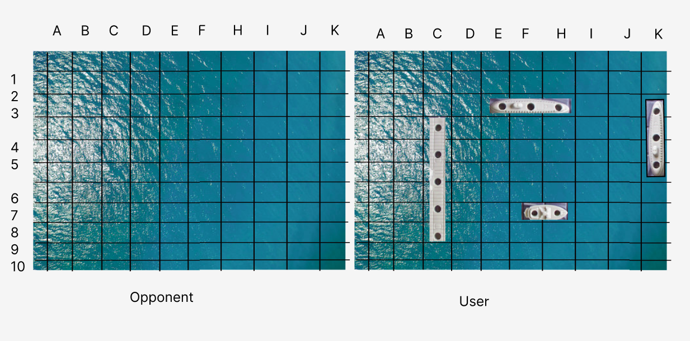
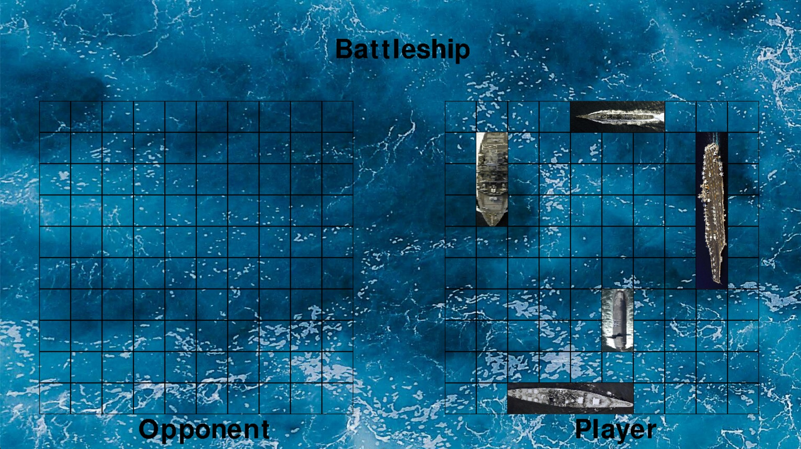

# Battleship
## CS110 Final Project  Spring, 2024

## Team Members

Shawn Healy

## Project Description

This project will allow the user to play a game of the classic board game, Battleship, against an AI. First, both the user and AI will select where to position their battleships, and then they will take turns striking until all ships have been sunk and a player has won. The game will have 3 different difficulties: Easy, where the AI fires completely randomly with no strategy, medium where the AI fires randomly, but once it hits a target, it will lock on and proceed and try to sink the whole ship, and finally hard, where machine learning will be incoporated to teach the AI the most optimal attacks and placements for ships.

## GUI Design

### Initial Design

### Final Design

## Program Design

### Features

1. Start Menu
2. 3 Difficulty Levels
3. Game Over Screen
4. Machine Learning for Hard AI
5. Drag and Drop to Place Ships

### Classes

- Board:
- Cell:
- Ship:
- Ai:
- Player:
- Controller:

## ATP

| Step                 |Procedure             |Expected Results                   |
|----------------------|:--------------------:|----------------------------------:|
|  1                   | Run Counter Program  |GUI window appears with count = 0  |
|  2                   | click count button   | display changes to count = 1      |
etc...
