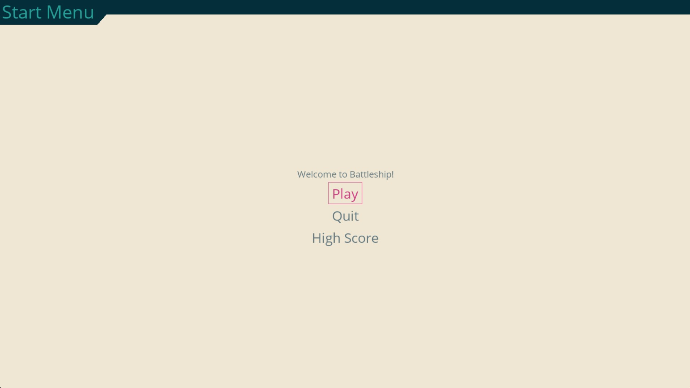

# Battleship
## CS110 Final Project Spring, 2024

## Team Members

Shawn Healy

## Project Description

This project will allow the user to play a game of the classic board game, Battleship, against an Ai which fires completely randomly. Once the game is started through the main menu, there will be two grids: the one on the left, which you are attacking, and the one on the right, which has your ships, which have already been placed for you. You will shoot first by clicking on a cell on the grid to the left, and it will either turn green if you have hit a ship or red if you have missed. There will be a 2 second delay and then the Ai will take its turn, and you will alternate until a player has won. Once you or the Ai has sunk all 5 of the opponents ships (17 cells) the game will end, and an end screen will pop up. There will also be a button on the main menu that when pressed will display the current high score (lowest amount of shots to win).

### Additional Modules Used

pygame-menu: https://pygame-menu.readthedocs.io/en/latest/

### Data Permanence Feature

An external file that keeps track of the high score for the game. Can be displayed through the main menu before the game

## GUI Design

### Initial Design
 

### Final Design

## Program Design

### Features

1. Start Menu
2. Game Over Menu
3. Click on Opponent Cell to Attack it
4. Basic Ai to play against (fires randomly)
5. Data Permanence Feature: Displays current high score

### Classes

Ship: This class handles all of the information regarding the individual ships themselves. This class keeps track of each ships size, coordinates on the grid, its current hits and whether the ship has been sunk yet.

Cell: This class handles all of the data for the individual cells and is closely related to the Board class so they are in the same file. The cell class keeps track of whether each cell individually has been hit yet and if it has a ship on the cell.

Board: This class takes in data from both the cell and ship classes to handle all of the data for the boards. The board is made up of a a list of lists of cell objects and has the methods add_ship where it takes in ship object as an argument and assigns all the cells accordingly. It has the receive_attack method which takes in the coordianes of the attacked cell as a argument and updates the board accordingly. It also has the game over condition all_sunk method which checks if a player has won by sinking all the ships.

Player: This is a very simple class that takes in a board object and keeps track of the player's board and all of their attacks by simply returning the argument which is the cell they are attacking.

Ai: This class is very similar to the Player class but it keeps track of all the possible moves the Ai can make. The Ai then makes a completely random move and removes that move from their possible moves to prevent repeats.

Controller: This class takes in all 5 of the other classes data and using the MVC style, draws all the display elements using pygame like the background, grid and ships. It sets up the main menu, end menu and also high score feature. It constantly checks for user input to see what cell they are attacking and updates the board with the player and ai's attacks while ending the game when a player has won.

## ATP

### Test #1: Test Start Button

- Step 1: Start Game
  - Open terminal, go to project folder, type: python main.py
  - Click on start button
- **Expected Outcome**
  - After clicking on the start button, the main menu should close and you should see the main game screen which has an ocean background and 2 grids one labeled player, and one labeled opponent. On the player grid, you should see 5 ships have already been placed for you.

### Test #2: Test Attacking Cells

- Step 1: Start Game
  - Open terminal, go to project folder, type: python main.py
  - Click on start button 
- Step 2: Attack Cell
  - To attack a cell, you simply click on any cell on the left grid
- **Expected Outcome**
  - There are two possible outcomes to this:
    1. If you have successfully hit a ship, the cell will turn green
    2. If you have missed, then the cell will turn red

### Test #3: Test Ai Opponent

- Step 1: Start Game
  - Open terminal, go to project folder, type: python main.py
  - Click on start button 
- Step 2: Attack Cell
  - To attack a cell, you simply click on any cell on the left grid
- Step 3: Wait for Ai response
- **Expected Outcome**
  - After you have attacked a cell and it has changed colors, there will be a two second pause and then the Ai will randomly fire. You will either see a cell that wasn't occuppied by a ship turn red, or if the Ai has successfully hit a ship then one cell on that ship will turn green.

### Test #4: Test Game Over Screen

- Step 1: Start Game
  - Open terminal, go to project folder, type: python main.py
  - Click on start button 
- Step 2: Attack Cell
  - To attack a cell, you simply click on any cell on the left grid
- Step 3: Wait for Ai response
- Repeat steps 2-3 until game is over
- **Expected Outcome**
  - After alternating turns with the Ai, once a player has successfully sunk all of their opponents battleships, the window will close and a new end game menu will open saying that you have either won or lost depending on who won the game.

  ### Test #5: High Score Feature

- Step 1: Start Game and click on High Score
  - Open terminal, go to project folder, type: python main.py
  - Click on the high score button
- **Expected Outcome**
  - When you hit the high score button, a new menu should open telling you the current high score which will update depending on the current high score.